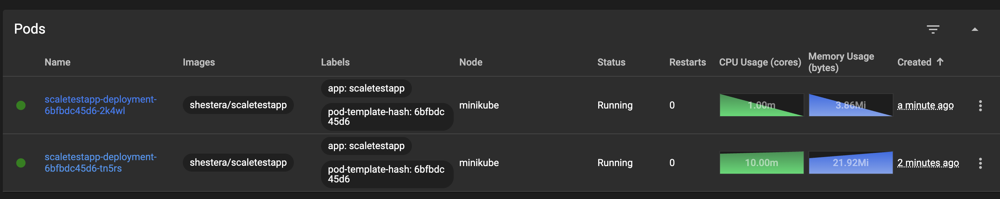

# Задание 2. Динамическое масштабирование контейнеров

## Инструкция по запуску

1. Перейти в папку Task2
2. `kubectl apply -f .`
3. `minikube service scaletestapp-service --url` - получить URL приложения
4. `minikube addons enable metrics-server`
5. `locust` - вставить URL из шага 3

## Результаты работы

